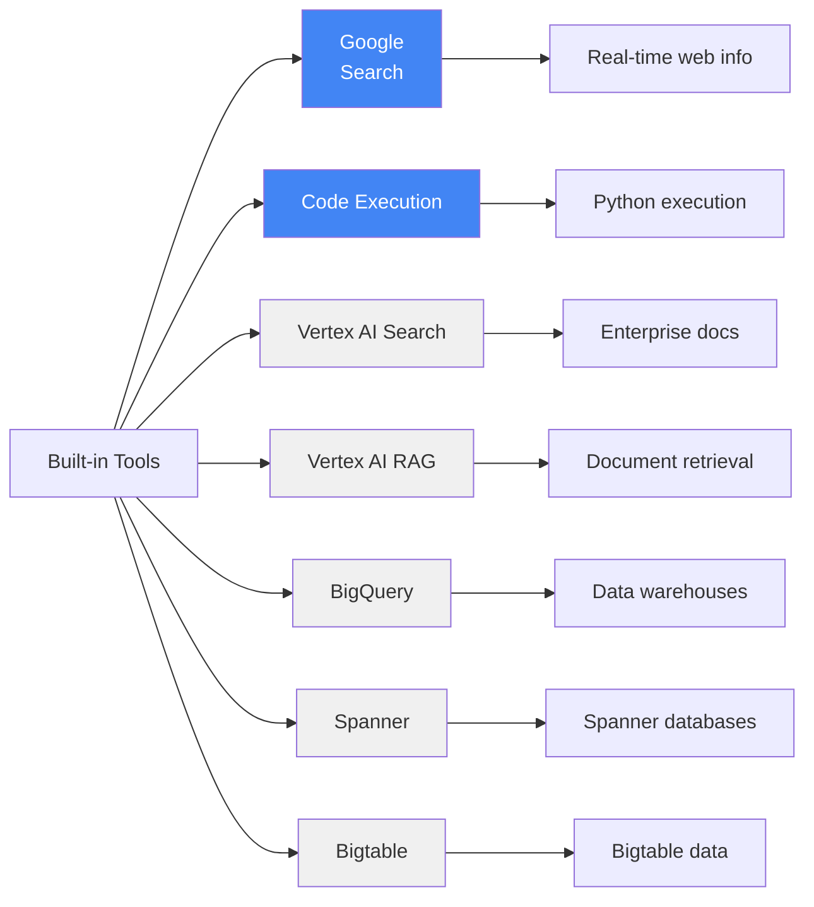
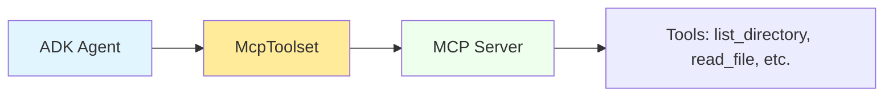
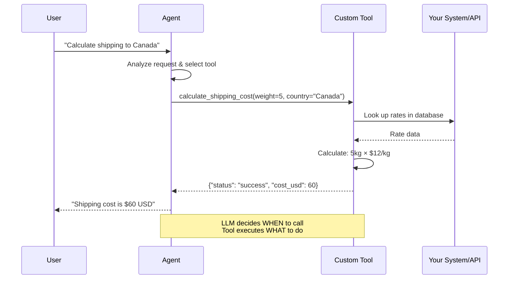
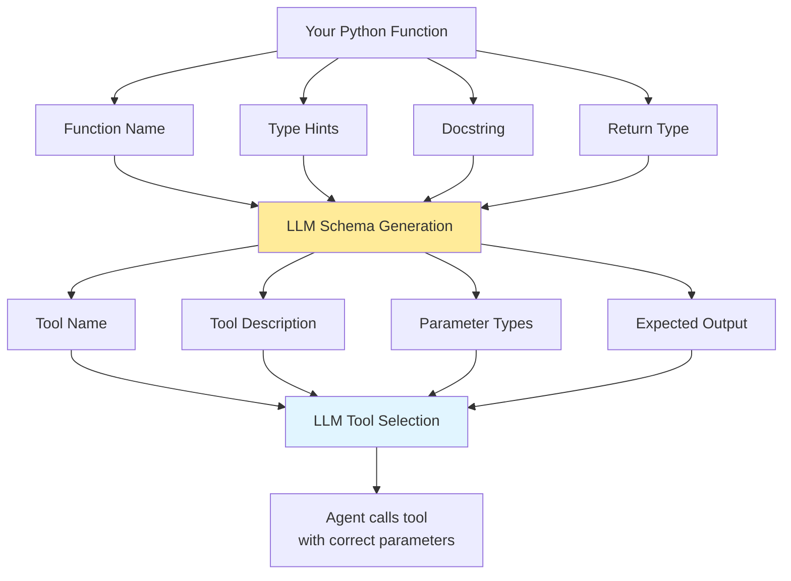
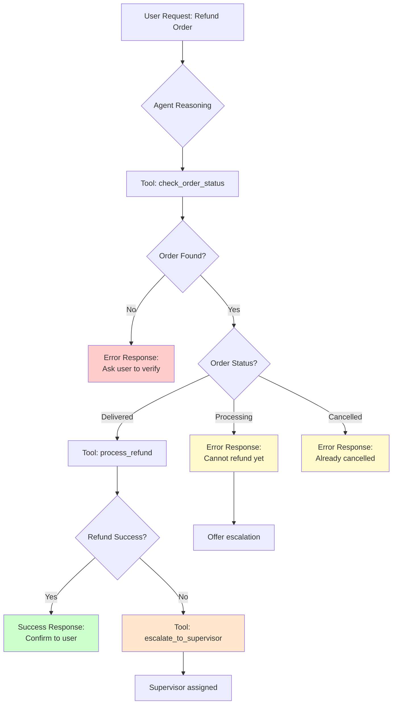
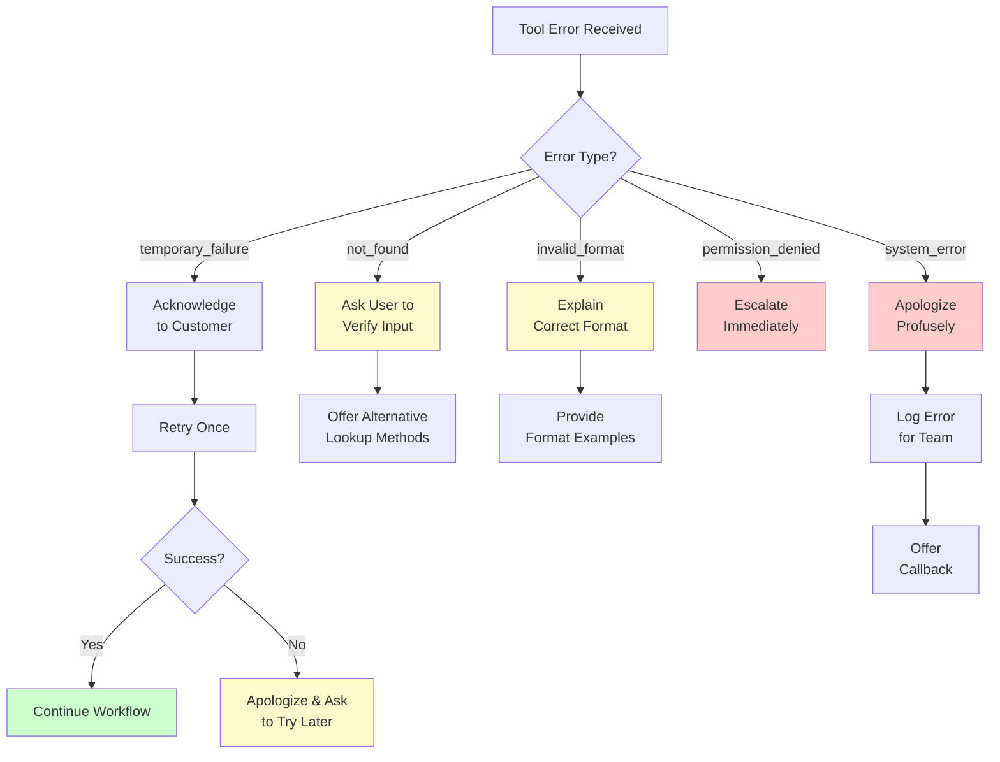
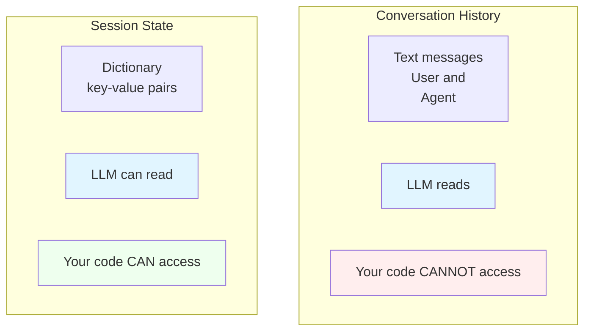
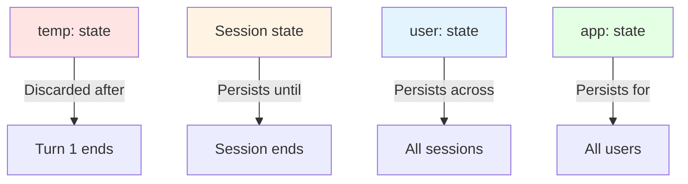
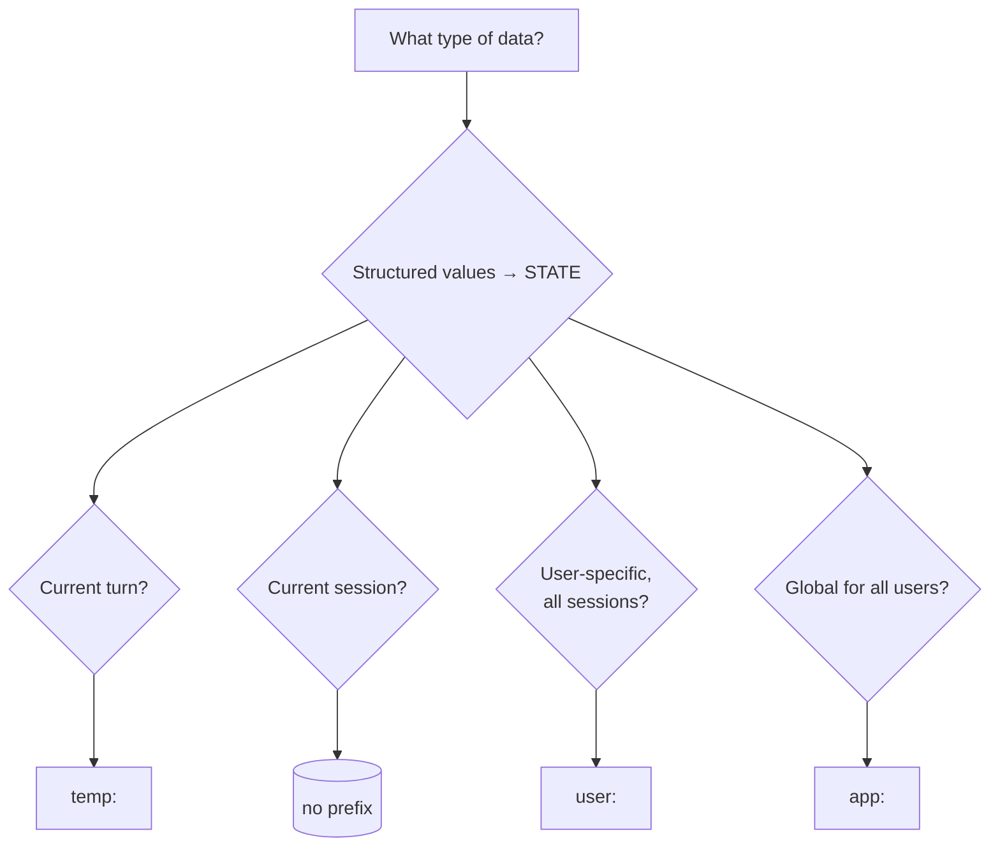

# Develop Agents with Agent Development Kit (ADK)

#### Author: Google

#### URL: <https://www.skills.google/paths/3545>

#### Rating: ⭐⭐⭐⭐⭐

### References

- <https://google.github.io/adk-docs/>
- <https://docs.astral.sh/uv/>

# [Build Agents with Agent Development Kit (ADK)](https://www.skills.google/paths/3545/course_templates/1585)

## Build Intelligent Agents

Deployment options: ADK agents are containerized:

- Managed runtime
- Serverless
- Custom Infra

# [Build Your First Agent with Agent Development Kit (ADK)](https://www.skills.google/paths/3545/course_templates/1563)

[T-DEVAGENT-I-m1-l1-en-file-1.en.pdf](T-DEVAGENT-I-m1-l1-en-file-1.en.pdf)

Remember: Agent = model + tools + orchestration

## The development workflow

1. Edit agent.py – Define your agent’s behavior
2. Run adk web – Test in the web interface
3. Iterate – Make changes, refresh, and test again
   1. adk run – Terminal-based interaction
   2. adk api_server – Deploy as an API service

## Recommended: create and activate a Python virtual environment

Create a Python virtual environment:

`python -m venv .venv`

Activate the Python virtual environment:

[Windows CMD](https://google.github.io/adk-docs/get-started/python/#windows-cmd)[Windows Powershell](https://google.github.io/adk-docs/get-started/python/#windows-powershell)[MacOS / Linux](https://google.github.io/adk-docs/get-started/python/#macos--linux)

`.venv\Scripts\activate.bat`

To exite `.venv`just type `deactivate`

[T-DEVAGENT-I-m2-l0-en-file-2.en.pdf](T-DEVAGENT-I-m2-l0-en-file-2.en.pdf)

## The four core parameters

1. Model
2. name
3. Description
   1. This description is primarily used by other LLM agents to determine if they should route a task to this agent. Make it specific enough to differentiate it from peers.
   - Good descriptions:

     ✅ “Handles customer billing inquiries and processes payment updates”
     ✅ “Analyzes sales data and generates weekly performance reports”
     ✅ “Helps students learn algebra by guiding them through problem-solving steps”
     ❌ “Billing agent” (too vague)
     ❌ “Helper” (not specific enough)

4. Instruction (optional)
   - Tips for effective instructions (from ADK docs):
     1. Be clear and specific: avoid ambiguity, clearly
        state the desired actions and outcomes
     2. Use markdown: Improve readability for complex
        instructions using headings, lists, etc.
     3. Provide examples (few-shot): For complex tasks
        or specific output formats, include examples
     4. Guide tool use: don’t just list tools, explain when
        and why the agent should use them

Key rule: Always assign your main agent to a variable named `root_agent`, so ADK tools can find it.

eg. `root_agent = my_specialized_agent`

[T-DEVAGENT-I-m2-l1-en-file-3.en.pdf](T-DEVAGENT-I-m2-l1-en-file-3.en.pdf)

[T-DEVAGENT-I-m3-l0-en-file-4.en.pdf](T-DEVAGENT-I-m3-l0-en-file-4.en.pdf)

## API Server with adk api_server

`adk api_server` runs your agent as a REST API service, allowing other applications to send requests to your agent over HTTP.

### Summary

- Developing? Use `adk web`
- Quick test? Use `adk run`
- Building an API? Use `adk api_server`
- Custom integration? Use programmatic execution

### Key takeaways

Choose the right tool:

- Use `adk web` for visual development and debugging
- Use `adk run` for quick command-line testing
- Use `adk api_server` for deploying as an API
- Use programmatic execution for custom Python applications

[T-DEVAGENT-I-m4-l0-en-file-5.en.pdf](T-DEVAGENT-I-m4-l0-en-file-5.en.pdf)

## Agent Config, which is ADK’s YAML-based approach to building agents

### Creating a YAML based agent

`adk create --type=config my_agent`

1. Create the agent project

   `adk create --type=config my_config_agent`

   the `--type=config`flag tells the ADK this is a YAML based agent

Understanding YAML syntax:
The vertical bar | after `instruction:` tells YAML everything that follows is multi-line text.

[T-DEVAGENT-I-m4-l0-en-file-6.en.pdf](T-DEVAGENT-I-m4-l0-en-file-6.en.pdf)

## Essential Commands for ADK

```bash
# Environment Setup
python3 -m venv adk-env      # Create virtual environment
source adk-env/bin/activate  # Activate (macOS/Linux)
adk-env\Scripts\activate     # Activate (Windows)
pip install google-adk       # Install ADK

# Create Agents
adk create my_agent          # Create Python-based agent
adk create --type=config my_agent   # Create YAML-based agent

# Run Agents
adk web                     # Web interface (from agent dir)
adk web my_agent            # Web interface (from parent dir)
adk run                     # Terminal execution
adk api_server
# REST API server
```

# [Engineer AI Agents with Agent Development Kit (ADK)](https://www.skills.google/paths/3545/course_templates/1596)

### Online Documentation

- [Agent Development Kit (ADK)](https://google.github.io/adk-docs/)
- [Google Search Tool for ADK](https://google.github.io/adk-docs/tools/gemini-api/google-search/)
- [Structuring Data with ADK](https://google.github.io/adk-docs/agents/llm-agents/#structuring-data-input_schema-output_schema-output_key)
- [Sequential Agents](https://google.github.io/adk-docs/agents/workflow-agents/sequential-agents/)

### Courses, Labs and Tutorials

- [Understand Google Cloud Agents](https://www.skills.google/course_templates/1504)
- [Build your first agent with Agent Development Kit (ADK)](https://www.skills.google/course_templates/1563)
- [Build intelligent agents with the Agent Development Kit
  (ADK)](https://www.skills.google/course_templates/1382)

# [Optimize Agent Behavior](https://www.skills.google/paths/3545/course_templates/1564)

The problem: Vague instructions create unpredictable behavior

[T-DEVAGENTOPT-I-m1-l0-en-file-1.en.pdf](T-DEVAGENTOPT-I-m1-l0-en-file-1.en.pdf)

[T-DEVAGENTOPT-I-m1-l1-en-file-2.en.pdf](T-DEVAGENTOPT-I-m1-l1-en-file-2.en.pdf)

### Key takeaways

Pattern 4 (boundaries): How the agent refuses inappropriate requests professionally

Pattern 5 (examples): How the agent mimics the communication style from the examples

How all five patterns work together to create predictable, professional behavior

The instruction parameter is arguably the most critical for shaping agent behavior

#### Five reusable patterns create professional instructions

- Identity - Who the agent is [Name], [Role], [Expertise]
- Mission - What the agent does
- Methodology - How the agent works
- Boundaries - What the agent won't do (Never/Always lists)
- Few-shot - How the agent should respond (Input→Output examples)

- Instruction boundaries layer on top of LLM safety settings for role-specific control
- Tool-based responses reduce hallucinations by grounding answers in facts
- Markdown formatting improves LLM comprehension and consistency (per ADK best practices)
- Patterns can be mixed and matched for different agent type

[T-DEVAGENTOPT-I-m2-l0-en-file-3.en.pdf](T-DEVAGENTOPT-I-m2-l0-en-file-3.en.pdf)

[T-DEVAGENTOPT-I-m2-l1-en-file-4.en.pdf](T-DEVAGENTOPT-I-m2-l1-en-file-4.en.pdf)

According to ADK documentation, use Pydantic BaseModel to define the exact structure you need.

### Pydantic Base Model [Python](https://www.notion.so/Python-2ab6fd7ad8f5803dafb6c3466b472bcb?pvs=21)

A **Pydantic** is **a class used to define the structure and validation requirements of data in Python using type annotations**. It serves as a foundation for creating data models, ensuring that data conforms to specified types and constraints upon instantiation. [[1](https://docs.pydantic.dev/2.4/concepts/models/), [2](https://docs.pydantic.dev/2.8/concepts/models/), [3](https://docs.pydantic.dev/latest/concepts/models/), [4](https://docs.pydantic.dev/1.10/usage/models/)]

**Core Functionality and Features**

- **Data Validation and Parsing**: The primary function of a `BaseModel` is to validate untrusted input data. When data is passed to a model, Pydantic automatically checks if it matches the field types defined in the class. If possible, it coerces data to the correct type (e.g., converting the string to the integer ); otherwise, it raises a .
- **Type Hint Integration**: It leverages Python's standard type hints, providing benefits like IDE auto-completion, linting, and static type checking with tools like .
- **Serialization and Deserialization**: Pydantic models can easily be serialized into formats like JSON and deserialized from raw data (e.g., dictionaries).
- **Schema Generation**: Models can automatically generate a JSON schema, which is useful for API documentation and integration with other tools. (This feature is heavily used by frameworks like FastAPI to generate interactive API docs).
- **Customization**: Developers can add custom validation logic using field and model validators or define custom data types to meet specific requirements.
- **Methods and Logic**: Pydantic models are regular Python classes, so you can define methods and properties on them to encapsulate business logic related to the data. [[1](https://docs.pydantic.dev/2.4/concepts/models/), [5](https://www.getorchestra.io/guides/fastapi-and-pydantics-basemodel-a-comprehensive-guide), [6](https://www.youtube.com/shorts/WeT0DRh9Dqg), [7](https://docs.pydantic.dev/1.10/), [8](https://www.reddit.com/r/Python/comments/16xnhim/what_problems_does_pydantic_solves_and_how_should/#:~:text=As%20others%20have%20already%20stated:%20the%20primary,find%20common%20in%20my%20line%20of%20work), [9](https://docs.pydantic.dev/latest/#:~:text=JSON%20Schema%20%E2%80%94%20Pydantic%20models%20can%20emit,the%20correct%20type%20where%20appropriate.%20Learn%20more%E2%80%A6), [10](https://docs.pydantic.dev/latest/concepts/serialization/#:~:text=Serializing%20data.%20Pydantic%20allows%20models%20(and%20any,serializable%20data%20(although%20this%20can%20be%20emulated).), [11](https://www.youtube.com/watch?v=XIdQ6gO3Anc#:~:text=This%20video%20tutorial%20explains%20how%20to%20use,with%20other%20applications%20or%20for%20saving%20data.), [12](https://www.getorchestra.io/guides/fast-api-model-methods-enhancing-pydantic-models-with-custom-methods#:~:text=Basic%20Understanding%20of%20Pydantic%20Models.%20Before%20diving,which%20Pydantic%20then%20uses%20for%20data%20validation.), [13](https://realpython.com/python-pydantic/#:~:text=In%20this%20tutorial%2C%20you'll%20learn%20how%20to:,Write%20custom%20validators%20for%20complex%20use%20cases;)]

Basic Usage Example

To use a `BaseModel`, you import it from the `pydantic` library and define a class that inherits from it, using type annotations for the fields. [[14](https://docs.pydantic.dev/latest/api/base_model/#:~:text=BaseModel.%20Pydantic%20models%20are%20simply%20classes%20which,BaseModel%20and%20define%20fields%20as%20annotated%20attributes.)]

You can then create an instance of the model with data: [[15](https://medium.com/data-science/train-a-neural-network-to-detect-breast-mri-tumors-with-pytorch-250a02be7777#:~:text=From%20here%20we%20can%20simply%20create%20an%20instance%20of%20the%20dataset%20with:)]

If the provided data is invalid and cannot be coerced, Pydantic raises a `ValidationError`. [[2](https://docs.pydantic.dev/2.8/concepts/models/)]

[T-DEVAGENTOPT-I-m3-l0-en-file-5.en.pdf](T-DEVAGENTOPT-I-m3-l0-en-file-5.en.pdf)

[T-DEVAGENTOPT-I-m3-l1-en-file-6.en.pdf](T-DEVAGENTOPT-I-m3-l1-en-file-6.en.pdf)

### Problem: Wrong temperature for task

No temperature configured - defaults to 1.0 (high creativity/randomness) _For factual tasks, we want temperature near 0!_

- Low temperature (0.0 - 0.3) - Deterministic
  - Use for: Facts, data extraction, analysis, consistency
- Medium temperature (0.4-0.7) - balanced
  - Use for: customer support, tutoring, general conversation
- High temperature (0.8-1.0) - creative
  - Use for: creative writing, brainstorming, marketing copy

Safety thresholds:

- `BLOCK_NONE`No filtering (not recommended
  for production)
- `BLOCK_ONLY_HIGH` Block only high-probability
  harmful content
  - Research internal tools
- `BLOCK_ONLY_MEDIUM_AND_ABOVE`Block medium
  and high probability
  - Business, general use
- `BLOCK_ONLY_LOW_AND_ABOVE`Most strict, blocks
  even low probability
  - Children, public-facing

### Parameters explained

- `max_output_tokens`: Maximum response length (default varies by model)
- `top_p`: Nucleus sampling—consider tokens comprising top P% of probability
- `top_k` : Only sample from the K most likely next tokens

[T-DEVAGENTOPT-I-m3-l0-en-file-7.en.pdf](T-DEVAGENTOPT-I-m3-l0-en-file-7.en.pdf)

### ADK BuiltInPlanner

What qualifies as a “complex problem”?

Complex problems require multiple considerations, trade-off analysis, or sequential reasoning.

[T-DEVAGENTOPT-I-m3-l1-en-file-8.en.pdf](T-DEVAGENTOPT-I-m3-l1-en-file-8.en.pdf)

`planner` (optional): Assign a `BasePlanner`instance to enable multi-step reasoning and planning before execution `BuiltInPlanner`: Leverages the model’s built-in planning capabilities (e.g., Gemini's thinking feature)

### Thinking levels (Gemini 3)

The `thinkingLevel` parameter, recommended for Gemini 3 models and newer, allows controlling reasoning behavior.

The following table details the `thinkingLevel` settings for each model type:

| **Thinking level** | **Gemini 3.1 Pro**               | **Gemini 3.1 Flash-Lite** | **Gemini 3 Flash**               | **Description**                                                                                                                                                                                                                                      |
| ------------------ | -------------------------------- | ------------------------- | -------------------------------- | ---------------------------------------------------------------------------------------------------------------------------------------------------------------------------------------------------------------------------------------------------- |
| **`minimal`**      | **incompatible**                 | **Supported** (default)   | **Supported**                    | Corresponds to the 'no thinking' setting for most queries. The model may think very minimally for complex programming tasks. Minimizes latency for chat or high-throughput applications. **`minimal`** does not guarantee that thinking is disabled. |
| **`low`**          | **Supported**                    | **Supported**             | **Supported**                    | Minimizes latency and cost. Ideal for following simple instructions, chatting, or high-throughput applications.                                                                                                                                      |
| **`medium`**       | **Supported**                    | **Supported**             | **Supported**                    | Balanced thinking for most tasks.                                                                                                                                                                                                                    |
| **`high`**         | **Supported** (padrão, dinâmico) | **Supported** (dinâmico)  | **Supported** (padrão, dinâmico) | Maximizes reasoning depth. The model may take much longer to generate the first output token (without thinking), but the output will be better reasoned.                                                                                             |

The following example shows how to set the thinking level.

[Python](https://ai.google.dev/gemini-api/docs/thinking?hl=pt-br#python)[JavaScript](https://ai.google.dev/gemini-api/docs/thinking?hl=pt-br#javascript)[Go](https://ai.google.dev/gemini-api/docs/thinking?hl=pt-br#go)[REST](https://ai.google.dev/gemini-api/docs/thinking?hl=pt-br#rest)

```
from google import genai
from google.genai import types

client = genai.Client()

response = client.models.generate_content(
    model="gemini-3-flash-preview",
    contents="Provide a list of 3 famous physicists and their key contributions",
    config=types.GenerateContentConfig(
        thinking_config=types.ThinkingConfig(thinking_level="low")
    ),
)

print(response.text)
```

It is not possible to disable thinking in Gemini 3.1 Pro. Gemini 3 Flash and Flash-Lite also do not support fully turning off reasoning, but the `minimal` setting means the model likely will not think (although it still might). If you do not specify a reasoning level, Gemini will use the default dynamic level for Gemini 3 models, `"high"`.

Gemini 2.5 series models do not support `thinkingLevel`. Use `thinkingBudget`.

The `thinking_budget`parameter guides the model on the number of thinking tokens to use when generating a response. The `include_thoughts` parameter controls whether the model should include its raw thoughts and internal reasoning process in the response.

Parameters explained:

`include_thoughts`If true, the response includes the agent's internal reasoning process | When True, you see the model's internal reasoning process in the response. Essential for debugging and understanding how the agent arrived at its answer.

`thinking_budget` : Number of tokens the model can use for thinking (not included in final response) | Controls how deeply the model can reason. Higher values (e.g., 2048) allow more thorough analysis for complex problems. Lower values (e.g., 512) are faster for simpler tasks.

#### Which planner should you use?

Use BuiltInPlanner when working with Gemini models (2.5 Flash, 2.5 Pro, 2.0 Flash)

- More natural reasoning process
- Configurable thinking depth with `thinking_budget`
- Optional visibility into reasoning with `include_thoughts`

Use PlanReActPlanner when:

- Working with non-Gemini models that lack built-in thinking
- You need strict output structure (PLANNING/ACTION/REASONING/FINAL_ANSWER)
- Building tool-heavy agents where explicit action phases help

[Slides includes code patterns references.](T-DEVAGENTOPT-I-m4-l0-en-file-9.en.pdf)

Slides includes code patterns references.

# [Add Agent Capabilities With Tools](https://www.skills.google/paths/3545/course_templates/1593)

[T-DEVAGENTTOOL-B-m1-l0-en-file-1.en.pdf](T-DEVAGENTTOOL-B-m1-l0-en-file-1.en.pdf)

[T-DEVAGENTTOOL-B-m1-l1-en-file-2.en.pdf](T-DEVAGENTTOOL-B-m1-l1-en-file-2.en.pdf)

### Agents use tools through five steps

Reasoning → Selection → Invocation → Observation → finalization

#### Three main tool types

- Built-in tools (ready-to-use)
- function tools (custom)
- agent-as-tool (delegation)

[T-DEVAGENTTOOL-B-m2-l0-en-file-3.en.pdf](T-DEVAGENTTOOL-B-m2-l0-en-file-3.en.pdf)

[T-DEVAGENTTOOL-B-m2-l1-en-file-4.en.pdf](T-DEVAGENTTOOL-B-m2-l1-en-file-4.en.pdf)



### IMPORTANT: Search suggestions policy

> If your response includes search suggestions (in `renderedContent`), you MUST display them in your application UI. This is a mandatory policy requirement.

- When using Google Search grounding you need to display search suggestions (`renderedContent`) in your application UI.
- Only one built-in tool can be used per root agent, with no other tools allowed in the same agent
- Built-in tools are production-ready, maintained by ADK, and optimized for LLM interaction

[T-DEVAGENTTOOL-B-m3-l0-en-file-5.en.pdf](T-DEVAGENTTOOL-B-m3-l0-en-file-5.en.pdf)

[T-DEVAGENTTOOL-B-m3-l1-en-file-6.en.pdf](T-DEVAGENTTOOL-B-m3-l1-en-file-6.en.pdf)



Best practice: Always use `tool_filter` in production to expose only the tools your agent needs.

## What MCP is and why it matters

- Open standard for connecting AI agents to external tool servers
- Universal interoperability: Works across AI frameworks (ADK, Claude, GPT)
- Industry adoption: Anthropic, OpenAI, Google, and The Linux Foundation
- Ecosystem access: Hundreds of pre-built tools for common tasks

### Connection types

- `StdioConnectionParams` - Local servers via subprocess (development)
- `SseConnectionParams` - Remote servers via HTTP (production)

### Using MCP in ADK

- `McpToolset` connects your agent to MCP servers
- Tools are discovered automatically - no manual registration
- Use like any other tool - same patterns from Module 1 apply

### Security with tool filtering

- Use `tool_filter` to expose only needed tools
- Limit to read-only when possible for safety
- Fewer tools = clearer decisions for your agent

[T-DEVAGENTTOOL-B-m3-l0-en-file-7.en.pdf](T-DEVAGENTTOOL-B-m3-l0-en-file-7.en.pdf)

[T-DEVAGENTTOOL-B-m3-l1-en-file-8.en.pdf](T-DEVAGENTTOOL-B-m3-l1-en-file-8.en.pdf)



## Core Concepts on Custom function tools

#### 1. Function signatures matter

1. Function name (Descriptive) - The LLM uses the function name to understand what the tool does.
   1. Use verb-noun pattern (get*, calculate*, search\_\*)

   ```python
   #  Good: Descriptive, verb-noun pattern
   def get_shipping_cost(weight: float, destination: str) -> dict:
       """Retrieves shipping cost for a package."""
       pass

   #  Bad: Generic, unclear names
   def process(data: float) -> dict:  # Process what?
       pass
   ```

2. Type Hints (Required) - Type hints tell ADK what types the LLM should provide
   1. ADK uses these to generate schema for the LLM

```python
#  Good: Type hints for all parameters and return
def lookup_order(order_id: str, user_id: int) -> dict:
    """Looks up order information."""
    pass

#  Bad: No type hints - LLM won't know what types to provide
def lookup_order(order_id, user_id):  # What types are these?
    pass
```

1. Parameter types - Use JSON-serializable types that LLMs understand:

- ✅ Supported: str, int, float, bool, list, dict
- ❌ Avoid: Complex custom classes, objects, file handles

```python
#  Good: Simple, JSON-serializable types
def book_flight(
    destination: str,
    departure_date: str,
    passengers: int
) -> dict:
    pass

#  Bad: Complex custom types
from datetime import datetime
from custom_models import Customer
def book_flight(
    destination: str,
    departure_date: datetime,  # Not JSON-serializable
    customer: Customer  # Custom class
) -> dict:
    pass
```

1. Do not set default values for parameters - Default values are not reliably supported or used by the underlying models.

```python
#  Recommended: All parameters required
def book_flight(destination: str, date: str, passengers: int) -> dict:
    """Books a flight."""
    pass

#    Not recommended: Default values may not work reliably
def search_flights(
    destination: str,
    max_price: float = 1000.0,  # Default may be ignored
    class_type: str = "economy"  # Default may be ignored
) -> dict:
    """Searches for flights."""
    pass
```

#### 2. Docstrings are critical

Explain what the tool does, when to use it, args, and returns.

“The docstring of your function serves as the tool’s description and is sent to the LLM. Therefore, a well-written and comprehensive docstring is crucial for the LLM to understand how to use the tool effectively.”

```python
def tool_name(param1: type1, param2: type2) -> dict:
    """[One-line summary of what this tool does]
    [Optional: Additional context about when to use this tool]
    Args:
    param1 (type1): [Description of param1]
    param2 (type2): [Description of param2]
    Returns:
    dict: [Description of return structure]
    On success: {'status': 'success', 'key': value}
    On error: {'status': 'error', 'error_message': 'explanation'}
    """
    # Implementation
    pass
```



#### 3. Return dictionaries with status

Always include status key for LLM comprehension

```python
# Success case
    return {
        "status": "success",
        "data_key": value,
        "another_key": another_value
    }

# Error case
    return {
        "status": "error",
        "error_message": "Human-readable explanation of what went wrong"
    }
```

### Best Practice Pattern

```python
def tool_name(param: type) -> dict:
    """Clear one-line summary.
    Additional context about when to use this tool.

    Args:
    param (type): Description of parameter.

    Returns:
    dict: Description of return.
    On success: {'status': 'success', 'data': value}
    On error: {'status': 'error', 'error_message': 'explanatiom'}
    """
    # Validate input
    if error_condition:
        return {"status": "error", "error_message": "Clear explanation"}
    # Perform operation
    return {"status": "success", "result_key": computed_value}
```

#### Multiple Tools

- **List all functions:** tools=[tool1, tool2, tool3]
- **Agent selects automatically:** Based on context and docstrings
- **Sequential usage:** Tools can build on each other's results
- **Reference in instructions:** Guide LLM on when to use each tool

[T-DEVAGENTTOOL-B-m4-l0-en-file-9.en.pdf](T-DEVAGENTTOOL-B-m4-l0-en-file-9.en.pdf)

[T-DEVAGENTTOOL-B-m4-l1-en-file-10.en.pdf](T-DEVAGENTTOOL-B-m4-l1-en-file-10.en.pdf)

### How to make good agents instructions

- **Organized sections:** Tool selection, workflows, error handling
- **Specific guidance:** When to use each tool
- **Step-by-step:** Clear sequential instructions
- **Error handling:** What to do for each error type



> **Key principle:** Different error types require different handling strategies.
> Specify exactly what the agent should do for each case.



### Agent-as-tool pattern

#### What is agent-as-tool?

Instead of writing a function tool, you can use another specialized agent as a tool. This allows the main agent to delegate complex subtasks to specialized agents.

#### When to use agent-as-tool

- Subtask requires specialized reasoning (not just predefined logic)
- Different instructions needed for the subtask
- Complex workflows within the subtask

| Aspect     | Function tool                    | Agent-as-tool                       |
| ---------- | -------------------------------- | ----------------------------------- |
| Implements | Predefined logic                 | Reasoning and decision-making       |
| Best for   | Calculations, lookups, API calls | Complex subtasks requiring judgment |
| Example    | `calculate_shipping()`           | Technical support specialist        |

### Strategic Instructions

```python
instruction="""
## Tool Usage Guidelines

### Tool Selection
[When to use which tool]

### Workflows
[Step-by-step procedures]

### Error Handling
[What to do for each error type]

### Escalation
[When and how to escalate]
"""
```

[T-DEVAGENTTOOL-B-m4-l0-en-file-11.en.pdf](T-DEVAGENTTOOL-B-m4-l0-en-file-11.en.pdf)

---

### Best Practices Checklist

#### Tool Design

- [ ] Descriptive function names (verb–noun pattern)
- [ ] Type hints on all parameters
- [ ] Comprehensive docstrings (what, when, args, returns)
- [ ] Return dictionaries with `status` key
- [ ] Specific, user-friendly error messages
- [ ] Single, focused purpose per tool
- [ ] JSON-serializable parameter types

#### Instruction Design

- [ ] Reference tools by name
- [ ] Specify when to use each tool
- [ ] Define sequential workflows step-by-step
- [ ] Handle all error types with specific actions
- [ ] Include escalation paths
- [ ] Organize into clear sections

#### Built-in Tools

- [ ] Use Google Search for real-time information
- [ ] Use Code Execution for precise calculations
- [ ] Display search suggestions (policy requirement)
- [ ] Remember one built-in tool per agent limitation
- [ ] Use Gemini 2.0+ models

#### Error Handling

- [ ] Return specific error types
- [ ] Provide human-readable error messages
- [ ] Specify retry vs. give up strategies
- [ ] Define escalation criteria
- [ ] Test all error paths
- [ ] Document expected errors in docstrings

#### MCP Tools

- [ ] Check MCP Registry before writing custom tools
- [ ] Use `tool_filter` to limit exposed tools
- [ ] Use `StdioConnectionParams` for development
- [ ] Use `SseConnectionParams` for production
- [ ] Ensure Node.js is installed for npx-based servers

---

# [**Manage Agent Memory and State**](https://www.skills.google/paths/3545/course_templates/1584)

[T-DEVAGENTMEM-B-m1-l0-en-file-1.en.pdf](T-DEVAGENTMEM-B-m1-l0-en-file-1.en.pdf)

[T-DEVAGENTMEM-B-m1-l1-en-file-2.en.pdf](T-DEVAGENTMEM-B-m1-l1-en-file-2.en.pdf)

## Session State

Session state is a Python dictionary accessible through the `session.state` attribute.

Conceptually, `session.state` is a collection (dictionary or map) holding key-value pairs. It’s designed for information the agent needs to recall or track to make the current conversation effective



#### Key Characteristics of `State`[¶](https://google.github.io/adk-docs/sessions/state/#key-characteristics-of-state)

1. **Structure: Serializable Key-Value Pairs**
   - Data is stored as `key: value`.
   - **Keys:** Always strings (`str`). Use clear names (e.g., `'departure_city'`, `'user:language_preference'`).
   - **Values:** Must be **serializable**. This means they can be easily saved and loaded by the `SessionService`. Stick to basic types in the specific languages (Python/Go/Java/TypeScript) like strings, numbers, booleans, and simple lists or dictionaries containing _only_ these basic types. (See API documentation for precise details).
   - **⚠️ Avoid Complex Objects:** **Do not store non-serializable objects** (custom class instances, functions, connections, etc.) directly in the state. Store simple identifiers if needed, and retrieve the complex object elsewhere.
2. **Mutability: It Changes**
   - The contents of the `state` are expected to change as the conversation evolves.
3. **Persistence: Depends on `SessionService`**
   - Whether state survives application restarts depends on your chosen service:
   - `InMemorySessionService`: **Not Persistent.** State is lost on restart.
   - `DatabaseSessionService` / `VertexAiSessionService`: **Persistent.** State is saved reliably.

#### Organizing State with Prefixes: Scope Matters[¶](https://google.github.io/adk-docs/sessions/state/#organizing-state-with-prefixes-scope-matters)

Prefixes on state keys define their scope and persistence behavior, especially with persistent services:

- **No Prefix (Session State):**
  - **Scope:** Specific to the _current_ session (`id`).
  - **Persistence:** Only persists if the `SessionService` is persistent (`Database`, `VertexAI`).
  - **Example:** `session.state['current_intent'] = 'book_flight'`
- **`user:` Prefix (User State):**
  - **Scope:** Tied to the `user_id`, shared across _all_ sessions for that user (within the same `app_name`).
  - **Persistence:** Persistent with `Database` or `VertexAI`. (Stored by `InMemory` but lost on restart).
  - **Example:** `session.state['user:preferred_language'] = 'fr'`
- **`app:` Prefix (App State):**
  - **Scope:** Tied to the `app_name`, shared across _all_ users and sessions for that application.
  - **Persistence:** Persistent with `Database` or `VertexAI`. (Stored by `InMemory` but lost on restart).
  - **Example:** `session.state['app:global_discount_code'] = 'SAVE10'`
- **`temp:` Prefix (Temporary Invocation State):**
  - **Scope:** Specific to the current **invocation** (the entire process from an agent receiving user input to generating the final output for that input).
  - **Persistence:** **Not Persistent.** Discarded after the invocation completes and does not carry over to the next one.
  - **Use Cases:** Storing intermediate calculations, flags, or data passed between tool calls within a single invocation.
  - **When Not to Use:** For information that must persist across different invocations, such as user preferences, conversation history summaries, or accumulated data.
  - **Example:** `session.state['temp:raw_api_response'] = {...}`

`output_key`(optional): Provide a string key. If set, the text content of the agent's final response will be automatically saved to the session's state dictionary under this key. This is useful for passing results between agents or steps in a workflow.

Behind the scenes, the `Runner` uses the `output_key` to create the necessary `EventActions` with a `state_delta` and calls `append_event`.

#### Best Practices for State Design Recap[¶](https://google.github.io/adk-docs/sessions/state/#best-practices-for-state-design-recap)

- **Minimalism:** Store only essential, dynamic data.
- **Serialization:** Use basic, serializable types.
- **Descriptive Keys & Prefixes:** Use clear names and appropriate prefixes (`user:`, `app:`, `temp:`, or none).
- **Shallow Structures:** Avoid deep nesting where possible.
- **Standard Update Flow:** Rely on `append_event`.

[T-DEVAGENTMEM-B-m2-l0-en-file-3.en.pdf](T-DEVAGENTMEM-B-m2-l0-en-file-3.en.pdf)

[T-DEVAGENTMEM-B-m2-l1-en-file-4.en.pdf](T-DEVAGENTMEM-B-m2-l1-en-file-4.en.pdf)

[T-DEVAGENTMEM-B-m3-l0-en-file-5.en.pdf](T-DEVAGENTMEM-B-m3-l0-en-file-5.en.pdf)

[T-DEVAGENTMEM-B-m3-l1-en-file-6.en.pdf](T-DEVAGENTMEM-B-m3-l1-en-file-6.en.pdf)



[T-DEVAGENTMEM-B-m4-l0-en-file-7.en.pdf](T-DEVAGENTMEM-B-m4-l0-en-file-7.en.pdf)

### Decision tree for State use



# [**Build intelligent agents with Agent Development Kit (ADK)**](https://www.skills.google/course_templates/1382?catalog_rank=%7B%22rank%22%3A5%2C%22num_filters%22%3A2%2C%22has_search%22%3Atrue%7D&search_id=77940608)

# [**Deploy Multi-Agent Systems with Agent Development Kit (ADK) and Agent Engine**](https://www.skills.google/course_templates/1275?catalog_rank=%7B%22rank%22%3A7%2C%22num_filters%22%3A2%2C%22has_search%22%3Atrue%7D&search_id=77940608)

# [**Deploy Multi-Agent Architectures**](https://www.skills.google/course_templates/1445?catalog_rank=%7B%22rank%22%3A8%2C%22num_filters%22%3A2%2C%22has_search%22%3Atrue%7D&search_id=77940608)

# [**Deploy Your First Agent**](https://www.skills.google/course_templates/1639?catalog_rank=%7B%22rank%22%3A10%2C%22num_filters%22%3A2%2C%22has_search%22%3Atrue%7D&search_id=77940625)

# [**Build and Deploy Agents in Production**](https://www.skills.google/course_templates/1633?catalog_rank=%7B%22rank%22%3A11%2C%22num_filters%22%3A2%2C%22has_search%22%3Atrue%7D&search_id=77940625)
